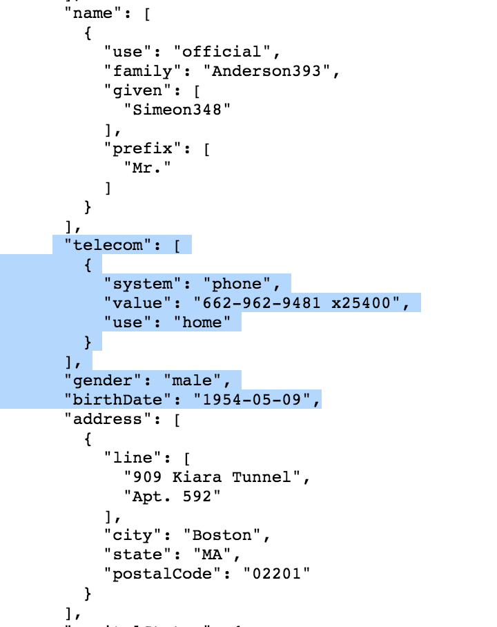

# HealthDataManager
This is an application that intakes ~50 elements of patient information through a voice user interface. These data elements are then configured into [Standard Health Record](http://standardhealthrecord.org) format. The data is displayed visually for predicting or managing health. 

## Current Work
Currently, the project intakes 11 elements of patient information through voice and prints three of those elements in SHR format. Voice data is transcribed and parsed using [DialogFlow](https://dialogflow.com) which returns a JSON. The JSON is then parsed for elements of interest and for the application's speech functions. 

This is an image of the current prototype interface. <a href="https://www.youtube.com/watch?v=KuPtWFArkU0">Here</a> is a video demo of the application.

 

This is an example SHR JSON that we are trying to output. The entire SHR JSON can be viewed in the Patient.JSON file in the github repo. The highlighted portion illustrates the current JSON that is outputted.

## How to Use
Currently, all code exists in the index.html file. To run the application, simply download the file and run the code in the environment of your choosing. Personally, I have been using [JSFiddle] (https://jsfiddle.net/) for running and debugging.
IMPORTANT: code must be run on an http or https server to allow microphone access. Localhost also works but just dragging the HTML file into a browser does not. This due to how security access to microphones are allowed.

## Future Goals 
- currently the SHR format is hardcoded, I would like to find a way to more easily generate SHR JSON
- 1 model/algorithm to help with predicting or managing my health.
- HIPAA compliant (using TrueVault)

## Core Contributors
Founders/Designers: [GoInvo](http://www.goinvo.com/), [hello@goinvo.com](mailto:hello@goinvo.com)

We believe that healthcare should be intuitive and accessible. Contact us with your questions and comments.

## License
Health Data Manager is [Apache 2.0](https://github.com/goinvo/HealthDataManager/blob/master/LICENSE) licensed.
