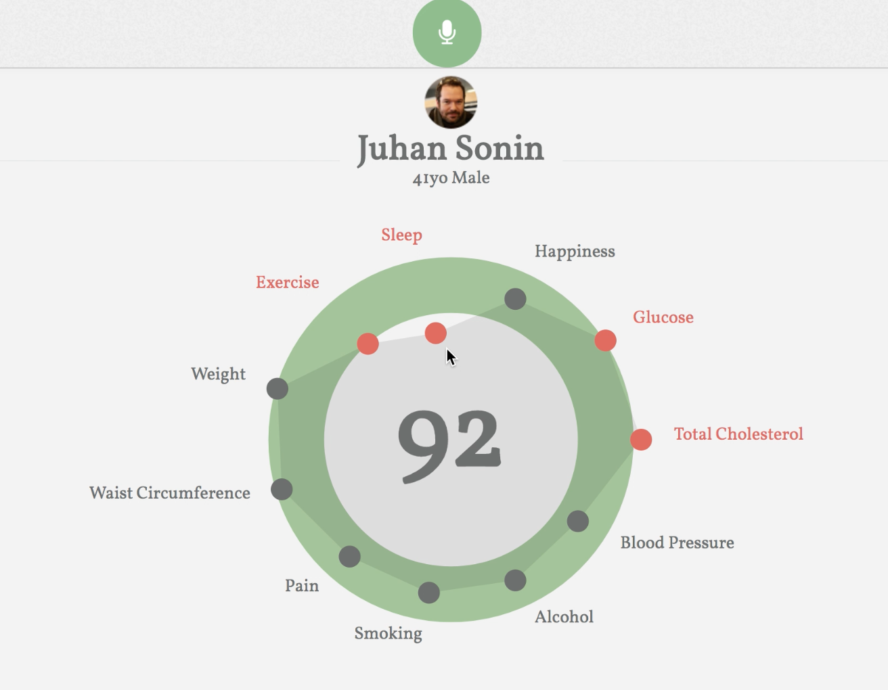

# HealthDataManager
This is an application that intakes ~50 elements of patient information through a voice user interface. These data elements are then configured into [Standard Health Record](http://standardhealthrecord.org) format. The data is displayed visually for predicting or managing health. 

## Current Work
Currently, this project has been adapt to be used with hGraph [http://hgraph.org/], a data visualization tool for patient health. Voice data is transcribed and parsed using [DialogFlow](https://dialogflow.com) which returns a JSON. The JSON is then parsed for elements of interest and updates the data for the graph. 

This is an image of the current prototype interface. <a href="https://youtu.be/Q_3ly1Erp9o">Here</a> is a video demo of the application.


 


## How to Use
Download or clone the hgraph file. In your terminal, run ```npm install ``` or ```yarn add``` in the hgraph directory. Then run ```npm start``` or ```yarn start```. 

The current React code is located in the demo file and can be run the same way.

IMPORTANT: code must be run on a https server to allow microphone access. Localhost also works but just dragging the HTML file into a browser does not. This due to how security access to microphones are allowed.

IMPORTANT: This application uses the Web Speech API for speech recognition. This API only runs on Chrome and Firefox. Other browsers are not supported at this time. 

## Future Goals 
- have the interface written in React for better interaction and animation
- currently the SHR format is hardcoded, I would like to find a way to more easily generate SHR JSON
- 1 model/algorithm to help with predicting or managing my health.
- HIPAA compliant (using TrueVault)

## Core Contributors
Founders/Designers: [GoInvo](http://www.goinvo.com/), [hello@goinvo.com](mailto:hello@goinvo.com)

We believe that healthcare should be intuitive and accessible. Contact us with your questions and comments.

## License
Health Data Manager is [Apache 2.0](https://github.com/goinvo/HealthDataManager/blob/master/LICENSE) licensed.
